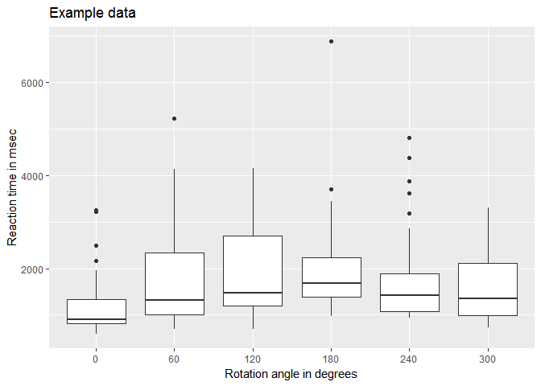

[](https://doi.org/10.5281/zenodo.5502450)

Mental rotation task
================
Jörn Alexander Quent
22 October 2017

-   [General information](#general-information)
-   [Recognition](#recognition)
-   [Description of the task](#description-of-the-task)
-   [Data](#data)
    -   [How to analyse the data in R](#how-to-analyse-the-data-in-r)
    -   [Display results](#display-results)
-   [References](#references)
-   [License](#license)

General information
===================

**Version:** 1.11

**License:** GPL-2

**URL:** <https://github.com/JAQuent/mentalRotation>

**Contact:** alex.quent (at) mrc-cbu.cam.ac.uk

Recognition
===========

Please recognise this work by citing it.

Description of the task
=======================

In this mental rotation, a trial starts with the presentation of a fixation cross for 250 msec (as in Shepard & Metzler, 1971), after which the target (i.e. mirrored or not-mirrored) and the rotated probe follow on the left and on the right, respectively. Subjects are asked to press the left arrow key if the stimulus on the left is mirrored and the right arrow key if the stimulus is not mirrored. The maximum presentation time is currently set to 8000 msec. If this time elapsed, the trial will be coded as no response. Reaction times, hits, false alarms, misses, correct rejections are recorded (see data analysis section). The instructions are in German.

Non-verbal stimuli - eight 8-points shapes (number 14, 15, 17, 18, 20, 22, 23, and 27) and two 12-points shapes (number 20 and 24) taken from Vanderplas and Garvin (1959) - are presented in this mental rotation task. The stimuli are presented in black on a white background. The same stimulus is shown on the screen two times. The stimulus on the left is horizontally mirrored on half of the trials, while the stimulus on the stimulus on the right side is rotated either 0, 60, 120, 180, 240 or 300 degrees. The experiment is divided into two blocks. A block consisted of every possible combination of the ten stimuli with the six rotation angles and both mirrored horizontally or left unchanged. Thus, there are 240 trials in total. If you have more questions, you can contact me.

Data
====

How to analyse the data in R
----------------------------

1.  Import the data:

``` r
data <- read.table("results/mentalRotation_example.dat", 
           header= FALSE)

names(data) <- c('subjectNumber', 'date', 'time', 'trialNumber', 'stimulus', 'block', 'rotationAngle', 'mirrored', 'response', 'correctness', 'RT', 'fixationOnsetTimte','stimulusOnsetTime', 'stimulusOffsetTime')

data$rotationAngle <- as.factor(data$rotationAngle)

head(data)
```

    ##   subjectNumber     date   time trialNumber stimulus block rotationAngle
    ## 1             1 20171022 100715           1       11     1            60
    ## 2             1 20171022 100715           2        6     1           240
    ## 3             1 20171022 100715           3       17     1           240
    ## 4             1 20171022 100715           4        9     1            60
    ## 5             1 20171022 100715           5        8     1            60
    ## 6             1 20171022 100715           6       19     1           240
    ##   mirrored response correctness       RT fixationOnsetTimte
    ## 1        0        1           2 1513.872           14.10068
    ## 2        0        0           4 1075.891           15.34751
    ## 3        1        1           1 1708.920           16.54261
    ## 4        0        0           4 2277.963           16.22813
    ## 5        0        0           4 1200.980           16.42355
    ## 6        1        1           1 3879.166           16.20884
    ##   stimulusOnsetTime stimulusOffsetTime
    ## 1          280.7125           1797.828
    ## 2          282.1128           1365.434
    ## 3          283.3211           2000.124
    ## 4          282.9717           2566.638
    ## 5          283.0982           1499.824
    ## 6          282.8440           4166.258

Display results
---------------

``` r
ggplot(data, aes(x = rotationAngle, y = RT)) + 
  geom_boxplot() + labs(x = 'Rotation angle in degrees', y = 'Reaction time in msec', title = 'Example data')
```



``` r
hits              <- sum(data$correctness == 1)/240
falseAlarms       <- sum(data$correctness == 2)/240
misses            <- sum(data$correctness == 3)/240
correctRejections <- sum(data$correctness == 4)/240

hits
```

    ## [1] 0.45

``` r
falseAlarms
```

    ## [1] 0.0875

``` r
misses
```

    ## [1] 0

``` r
correctRejections
```

    ## [1] 0.4625
    
Articles that use this task
===========================
Leeuwis N, Paas A andAlimardani M (2021) Vividness of Visual Imagery and Personality Impact Motor-Imagery Brain Computer Interfaces. Front. Hum. Neurosci. 15:634748.doi: 10.3389/fnhum.2021.634748

Leeuwis, N., and Alimardani, M. (2020). High aptitude motor imagery BCI users have better visuospatial memory. arXiv [Preprint]. arXiv:2010.02026.

References
==========

Shepard, R. N., & Metzler, J. (1971). Mental Rotation of Three-Dimensional Objects. Science, 171(3972), 701–703. https://doi.org/10.1126/science.171.3972.701

Vanderplas, J. M., & Garvin, E. A. (1959). The association value of random shapes. Journal of Experimental Psychology, 57(3), 147–154. https://doi.org/10.1037/h0048723

License
=======

Mental rotation task.

Copyright (C) 2017 Jörn Alexander Quent

This program is free software; you can redistribute it and/or modify it under the terms of the GNU General Public License as published by the Free Software Foundation; either version 2 of the License, or (at your option) any later version.

This program is distributed in the hope that it will be useful, but WITHOUT ANY WARRANTY; without even the implied warranty of MERCHANTABILITY or FITNESS FOR A PARTICULAR PURPOSE. See the GNU General Public License for more details.

You should have received a copy of the GNU General Public License along with this program; if not, write to the Free Software Foundation, Inc., 51 Franklin Street, Fifth Floor, Boston, MA 02110-1301, USA.
